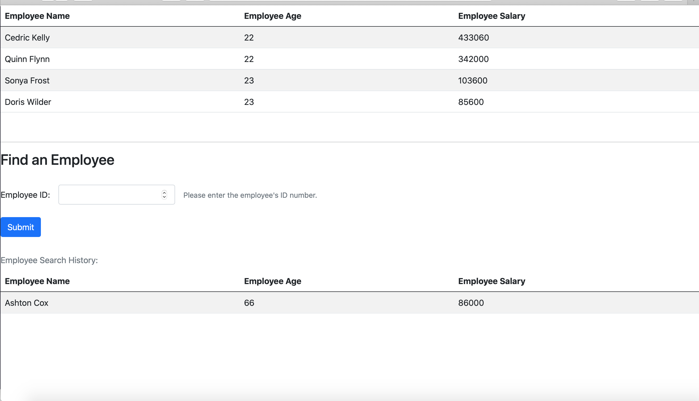

# Frontend Employee Data #

## Functionality ##

Returns a list of all employee records between ages of 22 & 28 whose salaries are greater than 1,000, sorted in descending order.\
-Find an employee-\
Returns an employee record if name begins with vowel.\

## Tools ##

Javascript, HTML, CSS, Boostrap\  
API: [dummy.restapiexample.com](dummy.restapiexample.com)